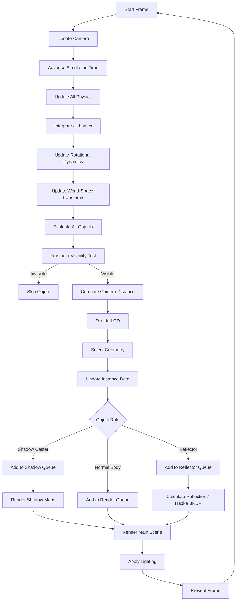

<h1 align="center">Custom C++ Engine for Celestial Body Simulation</h1>

https://github.com/user-attachments/assets/3ee465eb-00da-4448-86c8-a077777bcb80

<h2>Contents</h2>
<ul>
 <li><a href="#overview">Project Overview</a></li>
 <li>
  <a href="#mechanics">Celestial Mechanics, Rotational Dynamics and Object Modelling</a>
  <ul>
   <li>
    <a href="#integrators">Integrators</a>
    <ul>
     <li><a href="#wh">Wisdom-Holman</a></li>
     <ul>
      <li><a href="#energy-conservation-wh">Energy Conservation plots</a></li>
      <li><a href="#celestial-mechanics-wh">Celestial Mechanics</a></li>
      <li><a href="#rotational-dynamics-wh">Rotational Dynamics</a></li>
     </ul>
     <li><a href="#euler">Sympletic Euler</a></li>
     <ul>
      <li><a href="#energy-conservation-euler">Energy Conservation plots</a></li>
     </ul>
    </ul>
   </li>
  </ul>
 </li>
 <li><a href="#atmosphere">Atmosphere Modelling</a></li>
 <li><a href="#rendering">Rendering</a></li>
 <li><a href="#build">Build</a></li>
 <li><a href="#frame">Frame diagram</a></li>
 <li><a href="#bibliography">Bibliography</a></li>
</ul>

<h2 id="overview">Project Overview</h2>
The project implements a custom C++ simulation engine specialized for celestial body dynamics. It combines:

 - N-body gravitational dynamics.
 - Keplerian orbital elements for solar-system bodies.
 - Rotational, tidal, and gravity-field models.
 - A 3D atmospheric fluid dynamics solver on a pressure–latitude–longitude grid with conserved momentum.
 - GPU-accelerated (OpenCL) and CPU multi-threaded backends.

The simulation currently models the Solar System.
The engine is structured as a modular real-time application rather than a pure scientific library, enabling interactive exploration while keeping scientific precision and accuracy.

<h2 id="mechanics">Celestial Mechanics, Rotational Dynamics and Object Modelling </h2>
<h3>Object Hierarchy</h3>
Each body is either pure Object or OrbitalObject
Object has properties of any basic body, like:
<ul>
 <li>Mass</li>
 <li>Velocity</li>
</ul>
OrbitalObject extends Object class and adds properties such as:
<ul>
  <li>Orbit(owns KeplerElements)</li>
</ul>

<h3 id="integrators">Integrators</h3>
<h4 id="wh">Hybrid Wisdom-Holman Integrator</h4>
My version of WH Integrator contains:
<ul>
  <li>WH Integrator for hierarchical orbital bodies</li>
  <li>Leapfrog for other bodies</li>
</ul>

<h5 id="energy-conservation-wh">System energy conservation</h5>
<h6>Total energy</h6>

<h6>Potential energy</h6>


<h5 id="celestial-mechanics-wh">Celestial Mechanics</h5>
Each step can be divided into Half-Kick or Drift
The sequence looks like
1. Half-Kick
2. Drift
3. Half-Kick

Half Kick applies basic <a href="https://en.wikipedia.org/wiki/Newton%27s_law_of_universal_gravitation">Newton's law of universal gravitation</a> for each body.
For CPU pipeline it uses <p>$$\boldsymbol{O}(\frac{N^2 - N}{2})$$</p>

algorithm version to speed it up, while GPU pipeline uses basic 
<p>$$\boldsymbol{O}(N^2)$$</p> algorithm to prevent unnecessary kernel runs.

Drift advances <a href="https://en.wikipedia.org/wiki/Mean_anomaly">Mean anomaly</a> each step
<p>
  $$
  M_{n+1} = M_{n} + \eta\Delta t 
  $$
</p>
Where 
<p>
  $$
  \eta = \sqrt{\frac{\mu}{a^3}}
  $$
</p>
<a href="https://en.wikipedia.org/wiki/Newton%27s_method">Newton-Raphson</a> iteration
<p>
  $$
  E_{n+1} 
  = E_n - \frac{E_n - e\sin(E_n)-M}
  {1-e\cos(E_n)}
  $$
</p>
to solve <a href="https://en.wikipedia.org/wiki/Kepler%27s_equation">Kepler's equation</a>
<p>
  $$
  M = E - e\sin(E)
  $$
</p>
and then solves equations to predict updated position.
<p>
  $$
  pos_{orb} = \begin{bmatrix}
  a(\cos(E) - e)\\
  a\sqrt{1-e^2} * \sin(E)\\
  0
  \end{bmatrix}
  $$
</p>

<p>
  $$
  pos = pos_{central} + R_3(\Omega) R_1(i) R_3(\omega) pos_{orb}
  $$
</p>


<h5 id="rotational-dynamics-wh">Rotational Dynamics</h5>
Half Kick calculates torque by combining gravitational torque for every body and <a href="https://en.wikipedia.org/wiki/Tidal_force">tidal torque</a> for bodies with defined properties, it assumes constant tidal properties, such like constant tidal factor.

Tidal torque:
<p>
$$
\boldsymbol{\tau}_{\mathrm{tidal}}
=
-\frac{3}{2}
\frac{k_2}{Q}
\frac{\mu^2r^5}{d^6}
(\omega-\mathbf{n})
$$
</p>
Drift uses quaternion kinematics to represent rotation of the body.

The rotation quaternion is calculated from the current angular velocity:

$$
\theta = |\omega|\Delta t
$$

where:
- $\boldsymbol{\omega}$ is the body's angular velocity vector
- $\theta$ is the rotation angle during the timestep

The rotation axis is:

$$
\hat{\mathbf{u}} =
\frac{\boldsymbol{\omega}}
{|\boldsymbol{\omega}|}
$$

The rotation quaternion is:

$$
q_{rot}=
(
\cos\frac{\theta}{2},
\hat{\mathbf{u}}\sin\frac{\theta}{2}
)
$$

The new orientation is obtained by:

$$
q_{n+1}=q_{n}q_{rot}
$$

---

<h4 id="euler">Sympletic Euler Integrator</h4>
Basic euler integrator, following equations:

$$
v_{n+1}=v_{n} + a_{n}{\Delta}t
$$
$$
p_{n+1}=p_{n} + v_{n+1}{\Delta}t
$$

<h5 id="energy-conservation-euler">System energy conservation</h5>
<h6>Total energy</h6>

<h6>Potential energy</h6>


<h2 id="atmosphere">Atmospheric Modelling</h2>
<h3>Grid</h3>
At its base it uses spherical pressure coordinate grid:
<p>
  $$
  (i, j, k)
  $$
</p>

Where
<ul>
  <li>i = longitude</li>
  <li>j = latitude</li>
  <li>k = pressure level</li>
</ul>

<h3>Initialization</h3>
At the beginning the grid is initialized with input data:
<ul>
  <li>Temperature T</li>
<li>Relative humidity RH</li>
<li>Specific humidity q</li>
<li>
Wind velocity:
<ul>
  <li>u (east-west)</li>
  <li>$$\nu$$ (north-south)</li>
  <li>w (vertical)</li>
</ul>
</li>
<li>Geopotential height $$\phi$$</li>
<li>
Cloud species:
<ul>
  <li>cloud ice</li>
  <li>cloud liquid</li>
  <li>rain</li>
  <li>snow</li>
</ul>
  </li>
<li>Ozone mixing ratio</li>
</ul>

This data is used to calculate:

<p>
  $$
  L_i = r\cos(j)\Delta i 
  $$
  $$
  L_j = r\Delta j
  $$
  $$
  L_k = \frac{h_{k+1} - h_{k-1}}{2}
  $$
</p>

and then volume of the cell is calculated:
<p>
  $$
  V = L_i L_j L_k
  $$
</p>

Initial density calculations:
<p>
  $$
  r_m = \frac{q}{1 - q}
  $$
  $$
  e = \frac{r_m p}{0.622 + r_m}
  $$
</p>

Where:
<p>
  <ul>
    <li>$$q$$ = specific humidity</li>
    <li>$$p$$ = pressure</li>
    <li>$$e$$ = water vapor pressure</li>
    <li>$$r_m$$ = mixing ratio</li>
  </ul>
</p>

Ideal gas equation:
<p>
  $$
  \rho = \frac{p_d}{R_d T} + \frac{e}{R_v T}
  $$
</p>

Where:
<p>
  <ul>
    <li>$$p_d = p - e$$</li>
    <li>$$R_d$$ = dry air constant</li>
    <li>$$R_v$$ = water vapor gas constant</li>
  </ul>
</p>


<h3>Integration</h3>
Each step total flux is calculated for each face:
<p>
  $$
  f = \rho v A
  $$
</p>


<h2 id="rendering">Rendering and Visualization</h2>
<h3>Hapke BRDF Model</h3>
It is used to calculate the light reflected from the moon towards the planet.
For each reflector body the set of parameters is defined:
<ul>
  <li> $$w$$ = single scattering albedo</li>
  <li> $$\theta$$ = macroscopic roughness angle (radians)</li>
  <li> $$h$$ = opposition effect width</li>
  <li> $$b0$$ = strength of the opposition effect</li>
  <li> $$h_{cb}$$ = width of the coherent backscatter opposition effect</li>
  <li> $$b0_{cb}$$ = strength of the coherent backscatter opposition effect</li>
  <li> $$b$$ = asymmetry parameter</li>
  <li> $$c$$ = weighting between backward and forward scattering</li>
</ul>

The light is calculated as:
<p>
  $$
  C = hapkeBRDF() \frac{L}{4 \pi d^2}
  $$
</p>
Where
<ul>
  <li>$$hapkeBRDF$$ = function, <a href="https://kernelo-mistis.gitlabpages.inria.fr/planet-gllim-front-end/rst/scientific_doc/photometric_models/hapke.html">full function here</a></li>
  <li>$$L$$ = Light Luminocity</li>
  <li>$$d$$ = distance between object and light source</li>
</ul>

<h3>Render pipeline</h3>

```mermaid
flowchart TD
    A[Object] -->|Update Physics| B{LOD Manager}
    B --> |Decide LOD level| C(InstanceManager)
    C --> |Update instance data| D{Render Queue Builder}
    D -->|Build Render Queue| E[Render]
    D -->|Build Shadow Queue| E[Render]
    D -->|Build Reflector Queue| E[Render]
  ```

<h2 id="build">Build</h2>
<h3>Requirements</h3>
Cmake 3.16+, OpenGL 4.1+, OpenCL 1.2+, C++20 compiler
<h3>Building</h3>

<h4>Clone Repository</h4>

```bash
git clone https://github.com/astanx/space_simulation
```

<h4>Build</h4>

Unix:
```bash
mkdir build
cd build
cmake ..
make
```

Windows:
```bash
mkdir build
cd build
cmake ..
cmake --build .
```

<h3>Running</h3>

To run program call
```bash
./Space
```
from /build directory

<h4>Arguments</h4>
There are some optional arguments 
<table>
  <thead>
    <tr>
      <th>Argument</th>
      <th>Default</th>
      <th>Description</th>
    </tr>
  </thead>
  <tbody>
    <tr>
      <td><code>--gpu</code></td>
      <td>off</td>
      <td>Forces GPU (OpenCL) backend</td>
    </tr>
    <tr>
      <td><code>--cpu</code></td>
      <td>on</td>
      <td>Forces CPU backend</td>
    </tr>
    <tr>
      <td><code>--precision float/double </code></td>
      <td>double</td>
      <td>Defines float/double precision for simulation</td>
    </tr>
    <tr>
      <td><code>--timestep time</code></td>
      <td>86400</td>
      <td>Sets initial timestep for the simulation, both positive and negative values supported</td>
    </tr>
    <tr>
      <td><code>--date day/month/year hour:minute:second</code></td>
      <td>1/1/2000</td>
      <td>Sets starting date for the simulation, <code>hour:minute:second</code> are optional</td>
    </tr>
    <tr>
      <td><code>--simulation</code></td>
      <td>on</td>
      <td>Enables simulation mode</td>
    </tr>
    <tr>
      <td><code>--force-model name</code></td>
      <td>direct</td>
      <td>Sets force model, supported models: direct</td>
    </tr>
    <tr>
      <td><code>--integrator name</code></td>
      <td>wh</td>
      <td>Sets integrator, suppored integrators: wh (Wisdom-Holman)</td>
    </tr>
    <tr>
      <td><code>--validate-energy</code></td>
      <td>off</td>
      <td>Enables energy validator mode</td>
    </tr>
    <tr>
      <td><code>--validator-precision float/double </code></td>
      <td>double</td>
      <td>Defines float/double precision for validator</td>
    </tr>
    <tr>
      <td><code>--steps step_count</code></td>
      <td>1</td>
      <td>Defines number of steps for validator</td>
    </tr>
    <tr>
      <td><code>--save folder</code></td>
      <td>Not defined</td>
      <td>Defines save directory for the validator history data, <b>optional</b></td>
    </tr>
  </tbody>
</table>

<h2 id="frame">Frame diagram</h2>



<h2 id="bibliography">Bibliography</h2>
<ul>
 <li>[1] Jack Wisdom & Mathew Holman — <a href="https://web.mit.edu/wisdom/www/nbodymap.pdf">Symplectic Maps for the N-Body Problem</a></li>
 <li>[2] J. Peraire & S. Widnall — <a href="https://ocw.mit.edu/courses/16-07-dynamics-fall-2009/dd277ec654440f4c2b5b07d6c286c3fd_MIT16_07F09_Lec26.pdf">3D Rigid Body Dynamics: The Inertia Tensor</a> </li>
 <li> [3] Valéry Lainey — <a href="https://arxiv.org/abs/1604.04184">Quantification of tidal parameters from Solar System data</a> </li>
 <li> [4] B. A. Archinal, C. H. Acton, M. F. A'Hearn et al. — <a href="https://www.researchgate.net/publication/323367643_Report_of_the_IAU_Working_Group_on_Cartographic_Coordinates_and_Rotational_Elements_2015">Report of the IAU Working Group  on Cartographic Coordinates and Rotational Elements: 2015</a></li>
 <li> [5] Bruce Hapke — <a href="https://www.researchgate.net/publication/248576653_Bidirectional_reflectance_spectroscopy_3_Correction_for_macroscopic_roughness">Bidirectional reflectance spectroscopy 3. Correction for macroscopic roughness</a> </li>
 <li> [6] Alexander Kuzminykh — <a href="https://elib.dlr.de/203152/1/Bachelorarbeit_Alexander_Kuzminykh_20210818.pdf">Physically Based Real-Time Rendering of the Moon</a> </li>
 <li> [7] Thomas Annen, Tom Mertens, Hans-Perter Seidel et al. — <a href="https://www.researchgate.net/publication/32893024_Exponential_Shadow_Maps">Exponential Shadow Maps</a> </li>
 <li> [8] Eric Heitz, Jonathan Dupuy, Stephen Hill, David Neubelt — <a href="https://dl.acm.org/doi/10.1145/2897824.2925895">Real-Time Polygonal-Light Shading with Linearly Transformed Cosines</a> </li>
 <li> [9] Pascal Lecocq, Arthur Dufay, Gaël Sourimant, Jean-Eudes Marvie — <a href="http://pascal.lecocq.home.free.fr/publications/lecocq_TVCG2017_analyticAreaLightShading.pdf">Analytic Approximations for Real-Time Area Light Shading</a> </li>
 <li> [10] Aakash KT, Eric Heitz, Jonathan Dupuy, P. J. Narayanan — <a href="https://arxiv.org/pdf/2203.11904">Bringing Linearly Transformed Cosines to Anisotropic GGX</a> </li>
 <li> [11] NASA/JPL — <a href="https://ssd.jpl.nasa.gov/planets/approx_pos.html">Approximate Positions of the Planets</a> </li>
 <li> [12] NASA/JPL — <a href="https://ssd.jpl.nasa.gov/astro_par.html">Astrodynamic Parameters</a> </li>
 <li> [13] NASA/JPL — <a href="https://ssd.jpl.nasa.gov/horizons/app.html#/">Horizons System</a> </li>
</ul>
